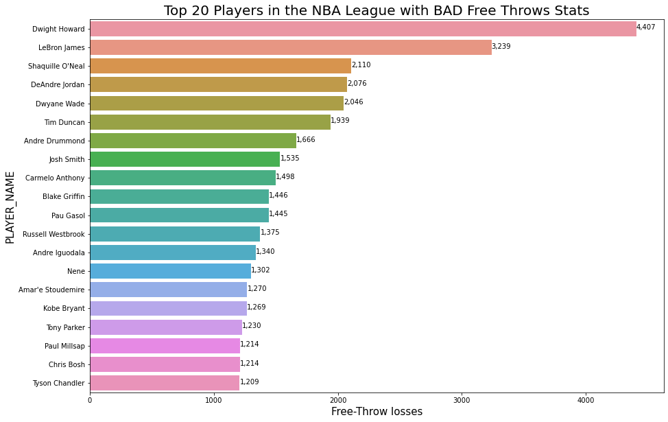

# NBA_ANALYSIS1

### Inspiration:
- This Notebook is created for all the NBA fans who love to see the stats of their favourite player, I have tried to make it as detailed as possible in this Notebook.
- Data has 460860 rows and 22 columns from **2004-2020**
- **Python 3.0**,**Jupyter Notebook**,**Seaborn**

### Data Visualisation:
- The graph shows top 20 players with Highest stats from 2004-2020

- **Lets see LeBron Laker vs LeRron Heat**

- Lerbon overall performace

### 3-Pointer Shooter

- As obvious we knew Steph curry would rule here. (Note: He joined NBA in 2009 and the data is available from 2004)

### Free Throw L's

- This graph shows players with the **worst Free Throw Shots.**

### Highest number of Blocks in the game

- Dwight Howard leads the chart of both the blocks and Free Throws L's, this clearly shows his role in L.A. Lakers right now.

